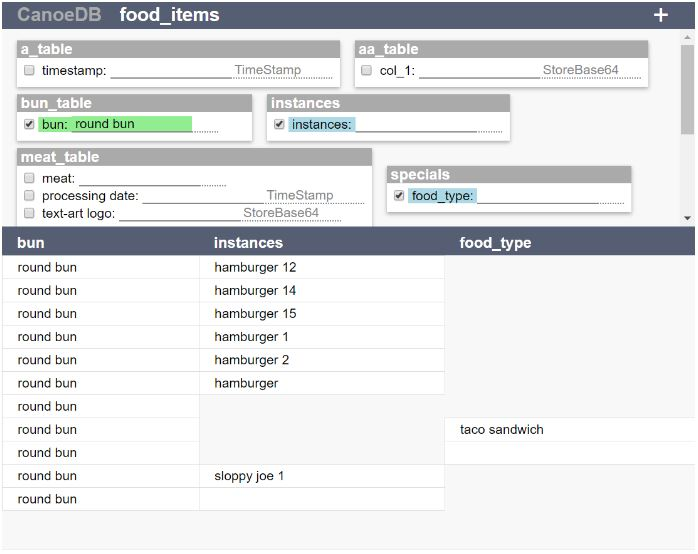

# CanoeDB  
Java database that converts a directory of .CSV files into a database.  
  
- Relational: each CSV file becomes a table with relationships to other tables  
- Auto-dereferencing: references between tables are dereferenced automatically  
- Simple ID: left column of table is always the reference ID column  
- Simple configuration.  First 3 rows include:  
	- Column names  
	- References to other tables  
	- Class apply a transformation to any data read or written in a column (dynamically loaded)  
  
  
	  
## Why Would I Write My Own Database?  
- motivation behind this project mainly stems from frustration in using SQL syntax to join random combinations of related tables.  
- SQL may be considered “declarative” in many cases, but the reality of following chains of references, between tables related by common cousin(s), is painfully imperative.  
- While at a previous employer, I ended up writing a microservice API layer to generate back-end SQL syntax for a MySQL database.  It seemed inefficient to compile a declarative API into imperative SQL so MySQL could compile that SQL into its internal data traversal algorithm.  
- CanoeDB is the fusion of that declarative microservice API layer directly to a table-structure traversal algorithm.  
  
### Tree-Structure vs. Related Tables:  
- Tree-like data structures are wonderful (e.g. JSON), but they aren’t always a silver bullet when it comes to overly intertwined and tangled data.  
- Example: the following describes a tree model of some departmental roles:  
```  
Department          Employee         Role  
+------------+     +---------+      +-------------+  
|Engineering +--+--+Manager  +------+Drinks coffee|  
+------------+  |  +---------+      +-------------+  
                |  
                |  +---------+      +-------------+  
                +--+Engineer1+------+Builds stuff |  
                |  +---------+      +-------------+  
                |  
                |  +---------+      +-------------+  
                +--+Engineer2+------+Builds stuff |  
                   +---------+      +-------------+  
  
- This looks great, until VP tells you he wants to see the hierarchy by Role->Employee->Department.  Or worse, Employee->Department->Role. Or both.  And he wants the Night Watchman added.  
```  
Role                 Employee           Department  
+-------------+     +--------------+   +-----------+  
|Builds stuff +--+--+Engineer1     +---+Engineering|  
+-------------+  |  +--------------+   +-----------+  
                 |  +--------------+   +-----------+  
                 +--+Engineer2     +---+Engineering|  
                    +--------------+   +-----------+  
                                        
+-------------+     +--------------+   +-----------+  
|Drinks coffee+--+--+Manager       +---+Engineering|  
+-------------+  |  +--------------+   +-----------+  
                 |  +--------------+   +-----------+  
                 +--+Night Watchman+---+Engineering|  
                    +--------------+   +-----------+  
```  
- Behind the scenes, every tree or object structure is ultimately described with primitive tables of references (sometimes explicitly and sometimes implicitly).  
```  
    +-------------+      +----------+      +-------------------------+  
    |Role         |      |Department|      |Employee      |Dept.|Role|  
+-----------------+  +--------------+  +-----------------------------+  
| 0 |Builds stuff |  | 0 |Enginering|  | 0 |Manager       |  0  | 1  |  
+-----------------+  +--------------+  +-----------------------------+  
| 1 |Drinks coffee|                    | 1 |Engineer1     |  0  | 0  |  
+-----------------+                    +-----------------------------+  
                                       | 2 |Engineer2     |  0  | 0  |  
                                       +-----------------------------+  
                                       | 3 |Night Watchman|  0  | 1  |  
                                       +-----------------------------+  
```  
- When you decompose a tree into tables with references, you’ll see there are end-node tables (e.g. Role & Department) and linking tables (e.g. Employee).  Technically, Employee could be an end-node table, a fourth table could link; but since the Employee table corresponds 1:1 with the linking table (in this case), we’ll just use the Employee table as the linking table.  
- What we’ve effectively accomplished is that we’ve decompiled the tree structure down into its table description.  
- We can now start at any one of the elemental tables and now build a tree-structure as we jump from table to table following references.  
  
### So How Do You Want to Store the Data?  
- In some cases you may want to store data pre-structured into a tree.  If you know beforehand how data will be structured, and if that structure will not change often, then a tree may be the ideal way to store data.   
- If, on the other hand, you want maintain flexibility in how the data will ultimately be structured, or if you will often need to change that structure, then storing data in its elemental related tables may be instead ideal.  
- Relational databases store data in elemental tables, while document databases (e.g. MongoDB) store data in tree-like (JSON/BSON) structures (i.e. documents).  It’s possible to add intertwining and merging (as opposed to branching) links between nodes in tree structures, and this is ideal in some situations, but the complexity of the tree-structure will significantly increase.  
  
## HTTP API  
  
  
  
## Architecture  
  
  
## Class descriptions  
  
  
## SPA Interface  
  
  
  
https://gabrielwilson3.github.io/  
